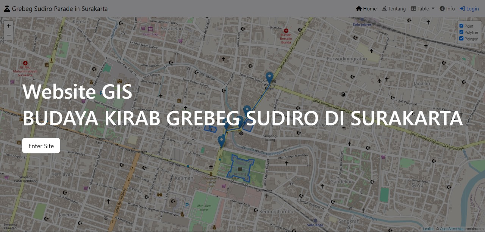

**Grebeg Sudiro Parade in Surakarta**

Dalam tradisi jawa, Grebeg bermakna perayaan rutin dan ucapan syukur dalam memperingati suatu peristiwa penting. Di Solo, perayaan Grebeg sudah hidup cukup lama dalam tradisi Keraton Surakarta Hadiningrat. Dalam setiap penyelenggaraan Grebeg, sebagai salah satu penanda khasnya adalah munculnya gunungan atau tumpeng yang biasanya berisi hasil bumi dan jajanan lokal. Sementara Sudiro merupakan nama yang diambil dari sebuah kampung bernama Kampung Sudiroprajan yang berada di sekitar kawasan Pasar Gede. Grebeg Sudiro adalah perayaan grebeg yang menjadi penanda akulturasi etnis Jawa dan Tionghoa di Kampung Sudiroprajan itu sendiri. Terdapat sumber yang mengatakan, Tradisi Grebeg Sudiro semula untuk memperingati ulang tahun Pasar Gede Hardjonagoro setiap tanggal 12 Januari. Perayaan Grebeg Sudiro digagas oleh warga etnis Tionghoa dan etnis Jawa yang tinggal di kawasan Kampung Sudiroprajan.

**Komponen Pembangun:**

- Laravel
- Bootstrap
- FontAwesome
- 

**Sumber Data:**

- [https://ppid.surakarta.go.id/](https://ppid.surakarta.go.id/)

**Tampilan Web GIS:**

